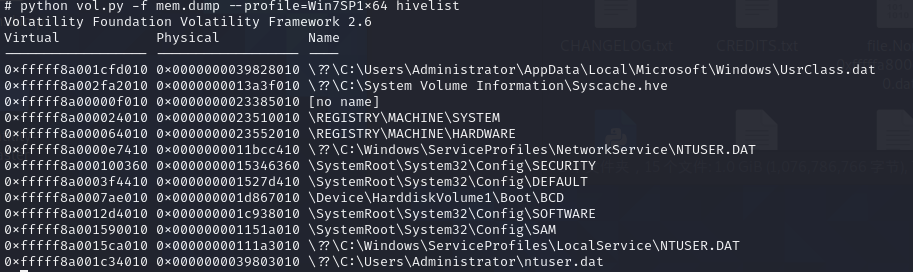

# 内存取证 #
&emsp;&emsp;内存取证是指在计算机系统的内存中进行取证分析，以获取有关计算机系统当前状态的信息。内存取证通常用于分析计算机系统上运行的进程、网络连接、文件、注册表等信息，并可以用于检测和分析恶意软件、网络攻击和其他安全事件
## Volatility ##
&emsp;&emsp;Volatility是一款开源的内存分析框架，主要用于从计算机内存中提取数字证据。它可以用于取证、恶意代码分析、漏洞研究、操作系统学习以及其他安全领域
### 基本命令使用格式 ###

    python vol.py -f [image] ‐-profile=[profile][plugin] 命令
    
    其中 -f 后面加的是要取证的文件， --profile 后加的是工具识别出的系统版本， [plugin] 是指使用的插件，其中默认存在一些插件，另外还可以自己下载一些插件扩充

使用`python vol.py -h `命令可查看基本的使用帮助吧
    
### 基本流程 ###
&emsp;&emsp;内存取证的流程简要概况就是以下几步：解析Windows/Linux/Mac OS的内存结构、分析进程等内存数据、根据题目提示寻找线索和思路，提取分析指定进程的特定内存数据.  
&emsp;&emsp;识别常用文件名后缀，如raw文件、vmem文件、img文件、dmp文件等内存镜像文件

    volatility -f [] imageinfo 
    []中添加文件名

&emsp;&emsp;用该命令查看基本信息，根据查到的信息确定profile的值
剩下的基本流程可以推荐看一下[这篇博客](https://cloud.tencent.com/developer/article/1419462 "volatility")

### 命令 ###

- amcache        	查看AmCache应用程序痕迹信息
- apihooks       	检测内核及进程的内存空间中的API hook
- atoms          	列出会话及窗口站atom表
- atomscan       	Atom表的池扫描(Pool scanner)
- auditpol       	列出注册表HKLMSECURITYPolicyPolAdtEv的审计策略信息
- bigpools       	使用BigPagePoolScanner转储大分页池(big page pools)
- bioskbd        	从实时模式内存中读取键盘缓冲数据(早期电脑可以读取出BIOS开机密码)
- cachedump      	获取内存中缓存的域帐号的密码哈希
- callbacks      	打印全系统通知例程
- clipboard      	提取Windows剪贴板中的内容
- cmdline        	显示进程命令行参数
- cmdscan        	提取执行的命令行历史记录（扫描 COMMAND HISTORY信息）
- connections    	打印系统打开的网络连接(仅支持Windows XP 和2003)
- connscan       	打印TCP连接信息
- consoles       	提取执行的命令行历史记录（扫描 CONSOLE INFORMATION信息）
- crashinfo      	提取崩溃转储信息
- deskscan       	tagDESKTOP池扫描(Poolscaner)
- devicetree     	显示设备树信息
- dlldump        	从进程地址空间转储动态链接库
- dlllist        	打印每个进程加载的动态链接库列表
- driverirp      	IRP hook驱动检测
- drivermodule   	关联驱动对象至内核模块
- driverscan     	驱动对象池扫描
- dumpcerts      	提取RAS私钥及SSL公钥
- **dumpfiles      	提取内存中映射或缓存的文件**
- dumpregistry   	转储内存中注册表信息至磁盘
- editbox        	查看Edit编辑控件信息 (Listbox正在实验中)
- **envars         	显示进程的环境变量**
- eventhooks     	打印Windows事件hook详细信息
- evtlogs        	提取Windows事件日志（仅支持XP/2003)
- **filescan       	提取文件对象（file objects）池信息**
- gahti          	转储用户句柄（handle）类型信息
- gditimers      	打印已安装的GDI计时器(timers)及回调(callbacks)
- gdt            	显示全局描述符表(Global Deor Table)
- getservicesids 	获取注册表中的服务名称并返回SID信息
- getsids        	打印每个进程的SID信息
- handles        	打印每个进程打开的句柄的列表
- **hashdump       	转储内存中的Windows帐户密码哈希(LM/NTLM)**
- hibinfo        	转储休眠文件信息
- **hivedump       	打印注册表配置单元信息**
- **hivelist       	打印注册表配置单元列表**
- hivescan       	注册表配置单元池扫描
- hpakextract    	从HPAK文件（Fast Dump格式）提取物理内存数据
- hpakinfo       	查看HPAK文件属性及相关信息
- idt            	显示中断描述符表(Interrupt Deor Table)
- **iehistory      	重建IE缓存及访问历史记录**
- imagecopy      	将物理地址空间导出原生DD镜像文件
- imageinfo      	查看/识别镜像信息
- impscan        	扫描对导入函数的调用
- joblinks       	打印进程任务链接信息
- kdbgscan       	搜索和转储潜在KDBG值
- kpcrscan       	搜索和转储潜在KPCR值
- ldrmodules     	检测未链接的动态链接DLL
- lsadump        	从注册表中提取LSA密钥信息（已解密）
- machoinfo      	转储Mach-O 文件格式信息
- malfind        	查找隐藏的和插入的代码
- mbrparser      	扫描并解析潜在的主引导记录(MBR)
- **memdump        	转储进程的可寻址内存**
- memmap         	打印内存映射
- messagehooks   	桌面和窗口消息钩子的线程列表
- mftparser      	扫描并解析潜在的MFT条目
- moddump        	转储内核驱动程序到可执行文件的示例
- modscan        	内核模块池扫描
- modules        	打印加载模块的列表
- multiscan      	批量扫描各种对象
- mutantscan     	对互斥对象池扫描
- **notepad        	查看记事本当前显示的文本**
- **netscan           查看命令行操作**
- objtypescan    	扫描窗口对象类型对象
- patcher        	基于页面扫描的补丁程序内存
- poolpeek       	可配置的池扫描器插件
- **printkey       	打印注册表项及其子项和值**
- privs          	显示进程权限
- procdump       	进程转储到一个可执行文件示例
- **pslist         	按照EPROCESS列表打印所有正在运行的进程**
- psscan         	进程对象池扫描
- pstree         	以树型方式打印进程列表
- psxview        	查找带有隐藏进程的所有进程列表
- qemuinfo       	转储 Qemu 信息
- raw2dmp        	将物理内存原生数据转换为windbg崩溃转储格式
- **screenshot     	基于GDI Windows的虚拟屏幕截图保存**
- servicediff    	Windows服务列表(ala Plugx)
- sessions       	_MM_SESSION_SPACE的详细信息列表(用户登录会话)
- shellbags      	打印Shellbags信息
- shimcache      	解析应用程序兼容性Shim缓存注册表项
- shutdowntime   	从内存中的注册表信息获取机器关机时间
- sockets        	打印已打开套接字列表
- sockscan       	TCP套接字对象池扫描
- ssdt           	显示SSDT条目
- strings        	物理到虚拟地址的偏移匹配(需要一些时间，带详细信息)
- **svcscan        	Windows服务列表扫描**
- symlinkscan    	符号链接对象池扫描
- thrdscan       	线程对象池扫描
- threads        	调查_ETHREAD 和_KTHREADs
- **timeliner      	创建内存中的各种痕迹信息的时间线**
- timers         	打印内核计时器及关联模块的DPC
- truecryptmaster	Recover 	恢复TrueCrypt 7.1a主密钥
- truecryptpassphrase		查找并提取TrueCrypt密码
- truecryptsummary	TrueCrypt摘要信息
- unloadedmodules	打印卸载的模块信息列表
- **userassist     	打印注册表中UserAssist相关信息**
- userhandles    	转储用户句柄表
- vaddump        	转储VAD数据为文件
- vadinfo        	转储VAD信息
- vadtree        	以树形方式显示VAD树信息
- vadwalk        	显示遍历VAD树
- vboxinfo       	转储Virtualbox信息（虚拟机）
- verinfo        	打印PE镜像中的版本信息
- vmwareinfo     	转储VMware VMSS/VMSN 信息
- volshell       	内存镜像中的shell
- windows        	打印桌面窗口(详细信息)
- wintree        	Z顺序打印桌面窗口树
- wndscan        	池扫描窗口站
- yarascan       	以Yara签名扫描进程或内核内存

## 其他工具 ##
### Dumplt ###

&emsp;&emsp;利用Dumplt可以将一个系统的完整内存镜像dump下来，dumplt制作的内存镜像(raw文件)与系统内存接近

###AccessData FTK Imager###

**主要功能**：

1. 证据获取
1. 哈希值计算
1. 文件查看及提取
1. 镜像文件挂载
1. 数据恢复
1. 特定数据提取

## 实战 ##
下载得到附件，为一个dump文件  

先查看dump文件的profile值  
 

展示进程  

查看cmd命令，得知存在文件flag.ccx   

寻找flag.ccx文件，文件地址为0x3e435890  

dump文件  

寻找administrator的密码,列出SAM表的用户  

获取SYSTEM SAM的虚拟地址,分别为0xfffff8a000024010  0xfffff8a001590010  

hashdump获取用户密码的hash值  

CMD5查询hash值得到Administrator账户的密码  

CnCrypt加载得到flag,密码为ABCabc123  
